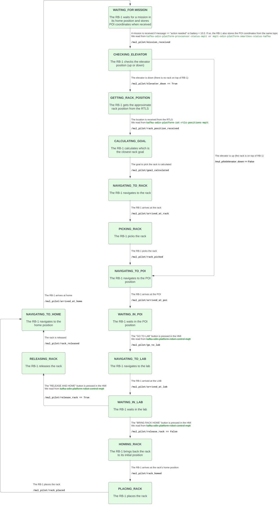

# mul_pilot

The mul_pilot package, based on RComponent structure. This package contains the necessary nodes to run during the MUL pilot of the [ODIN project](https://odin-smarthospitals.eu/) in February 2024.

## Installation

~~(Optional)~~

## 1 mul_pilot_node

This node implements the RB-1's state machine. The default state when starting the node is **WAITING_FOR_MISSION.**

  

### 1.1 Parameters

* <del>~parameter_name (type, default: value)\
   description</del>
   
### 1.2 Subscribed Topics

* **/mul_pilot/proxsensor (odin_msgs/ProxSensor)**\
  If the message "out_of_battery" is received in the `Status` subfield of the `data` field and the current state is **WAITING_FOR_MISSION,** the state is changed to **GETTING_LOCATION.**

* **/mul_pilot/smartbox (odin_msgs/SmartboxStatus)**\
  If the message value received in the `battery` subfield of the `data` field and the current state is **WAITING_FOR_MISSION,** the state is changed to **GETTING_LOCATION.**

* **/mul_pilot/rtls (odin_msgs/RTLS)**\
  From this topic we obtain the coordinates where the robot must navigate if it is in the **GETTING_LOCATION** state.

### 1.3 Published Topics

* ~~foo/topic_name (std_msgs/String)\
  topic description, including any important rate information~~

### 1.4 Services

Services are provided for the transition between states:

* **/mul_pilot/out_of_battery (std_srvs/Trigger)**\
  Allows the change from **WAITING_FOR_MISSION** to **GETTING_LOCATION.**

* **/mul_pilot/location_received (std_srvs/Trigger)**\
  Allows the change from **GETTING_LOCATION** to **NAVIGATING_TO_RACK.**

* **/mul_pilot/arrived_at_rack (std_srvs/Trigger)**\
  Allows the change from **NAVIGATING_TO_RACK** to **PICKING_RACK.**

* **/mul_pilot/rack_picked (std_srvs/Trigger)**\
  Allows the change from **PICKING_RACK** to **NAVIGATING_TO_HOME.**

* **/mul_pilot/arrived_at_home (std_srvs/Trigger)**\
  Allows the change from **NAVIGATING_TO_HOME** to **WAITING_FOR_MISSION.**

> [!NOTE]
> Services must be called from the appropriate state. If not, an error will be displayed on the screen, and the transition to the requested state will not occur.

### 1.5 Services Called

Services are called to switch between states automatically:

* **/mul_pilot/out_of_battery (std_srvs/Trigger)**\
  This service is called to automatically switch from **WAITING_FOR_MISSION** to **GETTING_LOCATION** when the corresponding data is received in `/mul_pilot/proxsensor` or `/mul_pilot/smartbox`.

* **/mul_pilot/location_received (std_srvs/Trigger)**\
  This service is called to automatically switch from **GETTING_LOCATION** to **NAVIGATING_TO_RACK** when the coordinates are received in `/mul_pilot/rtls`.

* **/mul_pilot/arrived_at_rack (std_srvs/Trigger)**\
  This service is called to automatically switch from **NAVIGATING_TO_RACK** to **PICKING_RACK** when the robot arrives at the rack.

* **/mul_pilot/rack_picked (std_srvs/Trigger)**\
  This service is called to automatically switch from **PICKING_RACK** to **NAVIGATING_TO_HOME** when the robot picks up the rack.

* **/mul_pilot/rack_picked (std_srvs/Trigger)**\
  This service is called to automatically switch from **NAVIGATING_TO_HOME** to **WAITING_FOR_MISSION** when the robot arrives at home.

### 1.6 Action Servers

* ~~foo/service_name (move_base_msgs/MoveBaseAction)\
  Action service description~~

### 1.7 Action Clients Called

* **/robot/move_base (move_base_msgs/MoveBaseAction)**\
  This Action Client is used to automatically change state when the robot finishes navigation tasks.

* **/robot/command_sequencer/action (robot_simple_command_manager_msgs/RobotSimpleCommandAction)**\
  This Action Client is used to automatically change state when the robot finishes the picking sequence.

### 1.8 Required tf Transforms

* ~~foo → bar\
  description of transform~~

### 1.9 Provided tf Transforms

* ~~baz → mumble\
  description of transform~~

### 1.10 Bringup

~~(optional)~~
