# mul_pilot

The mul_pilot package, based on RComponent structure. This package contains the necessary nodes to run a the MUL pilot of the ODIN project.

## Installation

~~(Optional)~~

## 1 mul_pilot_node

This node implements the RB-1's state machine. The default state when starting the node is WAITING_FOR_MISSION.

  

### 1.1 Parameters

* <del>~parameter_name (type, default: value)\
   description</del>
   
### 1.2 Subscribed Topics

* foo/topic_name1 (std_msgs/String)\
  topic_desciption 1

### 1.3 Published Topics

* foo/topic_name (std_msgs/String)\
  topic description, including any important rate information

### 1.4 Services

Services are provided for the transition between states:

* **/mul_pilot/out_of_battery (std_srvs/Trigger)**\
  Allows the change from **WAITING_FOR_MISSION** to **GETTING_LOCATION.**

* **/mul_pilot/location_received (std_srvs/Trigger)**\
  Allows the change from **GETTING_LOCATION** to **NAVIGATING_TO_RACK.**

* **/mul_pilot/arrived_at_rack (std_srvs/Trigger)**\
  Allows the change from **NAVIGATING_TO_RACK** to **PICKING_RACK.**

* **/mul_pilot/rack_picked (std_srvs/Trigger)**\
  Allows the change from **PICKING_RACK** to **NAVIGATING_TO_HOME.**

* **/mul_pilot/arrived_at_home (std_srvs/Trigger)**\
  Allows the change from **NAVIGATING_TO_HOME** to **WAITING_FOR_MISSION.**

> **Note that services must be called from the appropriate state. If not, an error will be displayed on the screen, and the transition to the requested state will not occur.**

### 1.5 Services Called

Services are called to automatically switch between states:

* foo/service_name (nav_msgs/GetMap)\
  service description

### 1.6 Action Servers

* ~~foo/service_name (move_base_msgs/MoveBaseAction)\
  Action service description~~

### 1.7 Action Clients Called

* ~~foo/service_name (move_base_msgs/MoveBaseAction)\
  Action service description~~

### 1.8 Required tf Transforms

* ~~foo → bar\
  description of transform~~

### 1.9 Provided tf Transforms

* ~~baz → mumble\
  description of transform~~

### 1.10 Bringup

~~(optional)~~
